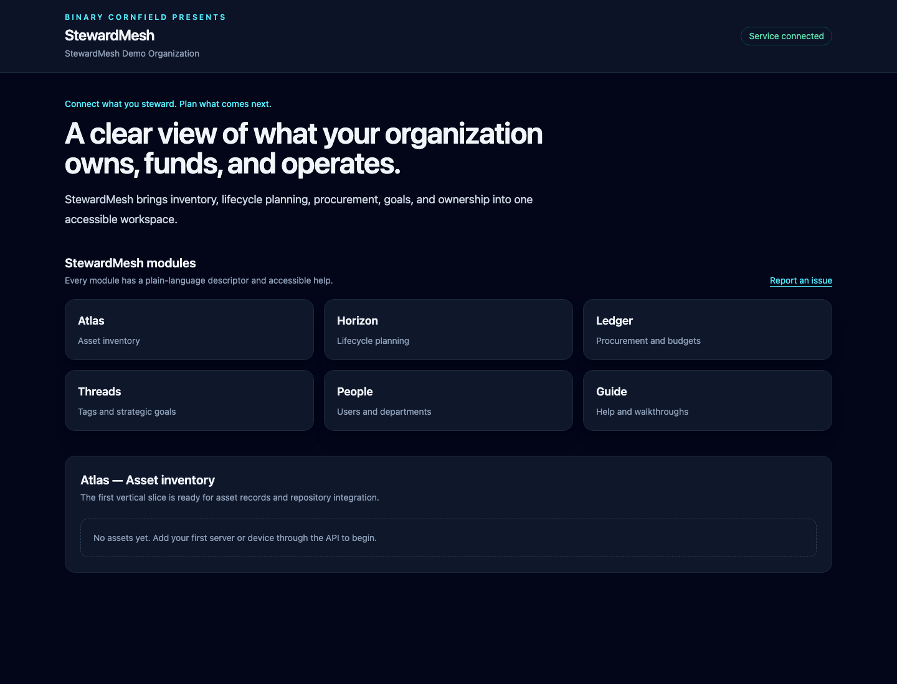

# Foundation — Organization bootstrap and shared platform boundaries

- **Canonical ID:** `platform.foundation`
- **Requirement:** `REQ-FOUNDATION-001`
- **Roadmap issue:** [#18](https://github.com/WSCMAX/StewardMesh/issues/18)

## Purpose

Foundation establishes the durable organization identity and provider-neutral contracts that every StewardMesh feature uses. PostgreSQL is the first persistent adapter. The in-memory adapter supports tests and deliberate zero-dependency evaluation, while future DynamoDB work must pass the same repository contracts.

## Users and permissions

The local bootstrap process runs as the trusted `system:bootstrap` actor. Organization identity changes will require Guard permissions when administration workflows are introduced. An organization ID is an ownership boundary and must not be silently replaced.

## Configuration and clean install

Set `STEWARDMESH_ORGANIZATION_ID`, `STEWARDMESH_ORGANIZATION_NAME`, `STEWARDMESH_REPOSITORY_DRIVER`, and the selected provider settings. The default `postgres` driver connects, verifies embedded migrations, bootstraps the organization idempotently, and records an audit event before serving requests. The `memory` driver is explicit and non-durable.

The default listener binds to loopback. A shared or container deployment must opt into a non-loopback address and provide deployment-specific authentication, TLS termination, and non-development database credentials.

`internal/application.New` is the reusable construction boundary for the HTTP
application. It validates configuration, initializes shared dependencies once,
and returns a transport-neutral handler plus idempotent cleanup. The server
command owns listener and process lifecycle concerns. Database migrations are
an explicit construction option so request-oriented transports can keep them in
deployment jobs.

The development stack is pinned to PostgreSQL 18.4. PostgreSQL 18+ stores its Docker data beneath `/var/lib/postgresql`; do not attach an older major-version volume without completing the appropriate PostgreSQL upgrade process. The example database URL disables TLS only for loopback development.

## APIs and schemas

- REST: `GET /api/v1/organization`
- OpenAPI: `api/openapi/openapi.yaml`
- gRPC contract: `api/proto/stewardmesh.proto`
- PostgreSQL migrations: `internal/repository/postgres/migrations`

Every HTTP response carries an `X-Correlation-ID`. A safe caller-provided value is preserved; malformed values are replaced. Error responses use stable codes, user-safe messages, and the same correlation identifier.

## Accessibility and help

The application shell announces the configured organization as polite status text without moving keyboard focus. The organization name remains plain text and is not conveyed by color. Guided setup help will link here when the organization setup interface is added.

Use the configurable in-application issue link to report a Foundation problem. Include the correlation ID, but never include credentials or a database URL.

## Application shell

## Audit events

- `organization.bootstrap.created`
- `organization.bootstrap.verified`

Audit records carry organization, actor, correlation, action, resource, timestamp, and metadata fields through a provider-neutral contract.

## Validation

- Configuration validation tests
- Reusable memory and PostgreSQL application construction tests
- Idempotent bootstrap service tests
- Repository and migration tests
- PostgreSQL integration test in CI
- HTTP ownership and correlation tests
- Machine-checked requirement traceability
